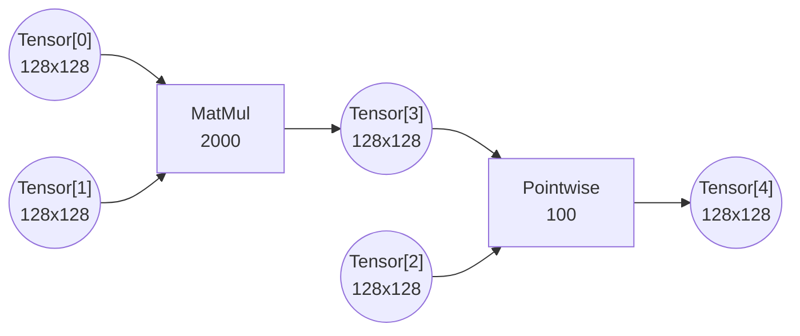

# Issue #32: MatMul-Pointwise Fusion and Execution Granularity

## Original post
- author: sohnryang
- created_at: 2026-02-24T10:30:23Z
- url: https://github.com/yarongmu-google/MLSys/issues/32

<comment>
> Yes.
> 
> This is permitted as long as the total working set for the fused subgraph fits within fast_memory_capacity.
> 
> Note that the entire subgraph will execute with a single granularity [w, h, k]. It is your responsibility to ensure that fusing a Pointwise op into a potentially tiled reduction (Split-K) remains mathematically valid. 

 _Originally posted by @yarongmu-google in [#14](https://github.com/yarongmu-google/MLSys/issues/14#issuecomment-3867752392)_

I have a question regarding this "mathematically valid" part. Consider this computation graph that looks like this, with native granularity `[128, 128]`.

Is it mathematically valid to fuse the MatMul and Pointwise into one subgraph and choose `[128, 128, 32]` as the execution granularity? For such granularity, how does the hardware execute this? Does it perform accumulation for MatMul in the ephemeral memory and perform the pointwise operation after the accumulation is complete?
</comment>

---

## Comment 1
- author: yarongmu-google
- created_at: 2026-03-11T23:34:51Z
- url: https://github.com/yarongmu-google/MLSys/issues/32#issuecomment-4042900526

<comment>
Thanks for the question.

No, this fusion is not valid with [128, 128, 32]. The entire subgraph must execute at a single granularity. With split-K, the MatMul takes 4 passes to accumulate its result, and the Pointwise cannot participate in those k-steps.
</comment>

---

## Comment 2
- author: yarongmu-google
- created_at: 2026-03-11T23:35:09Z
- url: https://github.com/yarongmu-google/MLSys/issues/32#issuecomment-4042901347

<comment>
I will resolve this for now. Please open a new issue if the above doesn't make sense.
</comment>

---

