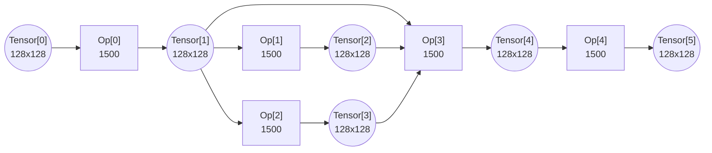

# Issue #34: Lifetime of retained tensors in the fast memory

## Original post
- author: sohnryang
- created_at: 2026-02-28T11:30:36Z
- url: https://github.com/yarongmu-google/MLSys/issues/34

<comment>
By specifying output tensors in `tensors_to_retain`, it is possible to keep output tensors in the fast memory after the execution of subgraph is finished. The problem statement doesn't specify the exact lifetime (i.e., when the retained tensors are "freed" from the fast memory) of the retained tensors. Can I assume that it is possible to have multiple tensors retained in the fast memory as long as the working set limit and data dependencies are respected? Also, is it fine to assume that retained tensors are freed right after the last consumer subgraph of the kept tensor is executed?

As an example, consider this computation graph:

Suppose that I have selected the subgraphs as `[[0, 1], [0, 2], [0, 3], [4]]`. Is it valid to retain tensor 2 in subgraph 0 and tensor 3 in subgraph 1? Also, can I assume that both retained tensors are freed from the fast memory right after subgraph 2 is run?
</comment>

---

## Comment 1
- author: yarongmu-google
- created_at: 2026-03-11T23:11:12Z
- url: https://github.com/yarongmu-google/MLSys/issues/34#issuecomment-4042814985

<comment>
Thanks for the question.

The lifetime of a retained tensor extends exactly one step:
  - tensors_to_retain[k] keeps tensors resident from step k into step k+1. After step k+1 completes, they are freed.
  - To keep a tensor alive for step k+2, step k+1 would need to also produce it and explicitly retain it in tensors_to_retain[k+1].

Btw note that subgraphs must form a connected sub-DAG - the ops must be linked through tensors within the subgraph so intermediate data can flow ephemerally. For example, [0, 3] would not be valid if there's no direct tensor path between Op 0 and Op 3 within the subgraph.
</comment>

---

## Comment 2
- author: yarongmu-google
- created_at: 2026-03-11T23:11:33Z
- url: https://github.com/yarongmu-google/MLSys/issues/34#issuecomment-4042816313

<comment>
I will resolve this for now. Please open a new issue if the above doesn't make sense.
</comment>

---

