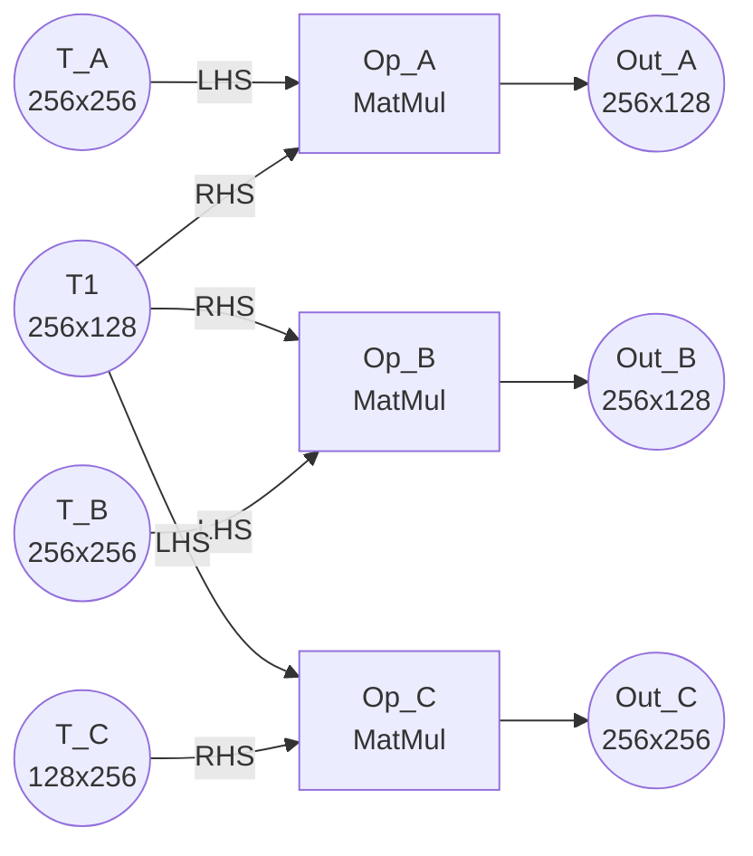

# Issue #75: Output Tensor Computation Order within a Subgraph

## Original post
- author: sohnryang
- created_at: 2026-04-13T14:46:53Z
- url: https://github.com/yarongmu-google/MLSys/issues/75

<comment>
The output format specifies `traversal_orders` to control tile iteration order, but does not specify the order in which output tensors of a fused subgraph are computed. For fused subgraphs with multiple output tensors that share an input tensor loaded in different block shapes (e.g., as RHS in one op vs LHS in another), the computation order affects implicit reuse of the shared tensor, and therefore total memory traffic.

Consider this graph:

All three ops are fused into one subgraph `[Op_A, Op_B, Op_C]` with granularity `[128, 128, 256]`. T1 (256×128) is shared by all ops, but loaded in different block shapes:

- **Op_A, Op_B**: T1 as RHS. K=256, output is 256×128 (2×1 grid). RHS strip = full T1 (256×128), same block at every tile.
- **Op_C**: T1 as LHS. K=128, output is 256×256 (2×2 grid). LHS strip = 128×128 row strip, differs by tile row.

Since these are independent ops in the same fused subgraph, they execute one output tensor at a time. The computation order determines which T1 block is resident at each phase boundary:

- After an RHS phase: T1 full (256×128) is resident.
- After the LHS phase: T1 row-1 strip (128×128) is resident.

Only an RHS→RHS boundary gives implicit reuse (same full block). RHS→LHS and LHS→RHS involve different block shapes, so no reuse per the partial-reuse ruling in #59.

### Order A→B→C (RHS→RHS→LHS): 11 loads

| Step | Phase | Tile | T1 block | T1 action | Other loads |
|------|-------|------|----------|-----------|-------------|
| 1 | Op_A | (0,0) | full 256×128 | **load** | T_A row0 |
| 2 | Op_A | (1,0) | full 256×128 | reuse | T_A row1 |
| 3 | Op_B | (0,0) | full 256×128 | **reuse (cross-phase)** | T_B row0 |
| 4 | Op_B | (1,0) | full 256×128 | reuse | T_B row1 |
| 5 | Op_C | (0,0) | row0 128×128 | **load** | T_C col0 |
| 6 | Op_C | (0,1) | row0 128×128 | reuse | T_C col1 |
| 7 | Op_C | (1,0) | row1 128×128 | **load** | T_C col0 |
| 8 | Op_C | (1,1) | row1 128×128 | reuse | T_C col1 |

Total T1 loads: 3. Total other loads: 8. **Grand total: 11.**

### Order A→C→B (RHS→LHS→RHS): 12 loads

| Step | Phase | Tile | T1 block | T1 action | Other loads |
|------|-------|------|----------|-----------|-------------|
| 1 | Op_A | (0,0) | full 256×128 | **load** | T_A row0 |
| 2 | Op_A | (1,0) | full 256×128 | reuse | T_A row1 |
| 3 | Op_C | (0,0) | row0 128×128 | **load** (256×128 !=128×128) | T_C col0 |
| 4 | Op_C | (0,1) | row0 128×128 | reuse | T_C col1 |
| 5 | Op_C | (1,0) | row1 128×128 | **load** | T_C col0 |
| 6 | Op_C | (1,1) | row1 128×128 | reuse | T_C col1 |
| 7 | Op_B | (0,0) | full 256×128 | **load** (128×128 != 256×128) | T_B row0 |
| 8 | Op_B | (1,0) | full 256×128 | reuse | T_B row1 |

Total T1 loads: 4. Total other loads: 8. **Grand total: 12.**

### Question

The difference is 1 full T1 load (32,768 elements). What output tensor computation order should participants assume when computing `subgraph_latencies` for a fused subgraph with multiple output tensors?
</comment>

---

## Comment 1
- author: yarongmu-google
- created_at: 2026-04-20T23:24:14Z
- url: https://github.com/yarongmu-google/MLSys/issues/75#issuecomment-4284892534

<comment>
Thanks for the question.

The observation about order-dependent memory traffic is spot-on. But before answering which order to assume, one issue with the specific example: 

Spatial padding is possible; temporal padding isn't. Spatial granules below tensor shape pad with unused compute and discard the excess — physically fine, just wasted cycles. But the reduction dimension is summed, not discarded. If you pick k = 256 while Op_C's reduction is only 128, there's nothing to stream into the back half of the granule — no data to reduce, and whatever gets summed in would corrupt the result. The spec mentions only k < native ("choosing k below native... proportional without waste"); k > K_op is physically undefined.

So the example as drawn is illegal: k ≤ K_op must hold for every matmul in the subgraph, and here Op_C.K = 128 < 256.
   
The real question, with a valid k = 128, is: does order still matter? 

The answer is: execution order = declared order in subgraphs[k] (with topological validity required). You order A->B->C vs A->C->B sufficiently distinguishes these 2.

</comment>

---

## Comment 2
- author: yarongmu-google
- created_at: 2026-04-20T23:24:47Z
- url: https://github.com/yarongmu-google/MLSys/issues/75#issuecomment-4284894300

<comment>
I will resolve the above. Please reopen with references to this issue, if the above doesn't make sense.
</comment>

---

