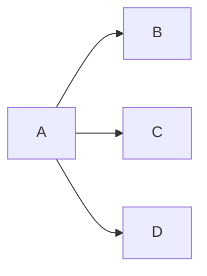

# Issue #77: Clarification: ephemeral tensor semantics in branch-fused subgraphs

## Original post
- author: WalnutHo
- created_at: 2026-04-15T06:12:46Z
- url: https://github.com/yarongmu-google/MLSys/issues/77

<comment>
Consider a fused subgraph where a single op (A) feeds multiple downstream
ops (B, C, D):

By the subgraph definition, `A_out` qualifies as ephemeral (zero fast-memory capacity and zero IO). The part we're unsure about: physically, `A_out`'s slice needs to remain in fast memory across all three consumers' reads. So the ephemeral-as-free rule seems to imply either a resource cost that isn't being modeled, or that this particular form of fusion wasn't intended to be supported. We'd like to make sure we're interpreting the spec the way the competition intended.

Three possibilities come to mind:

- **(a) `A_out`'s slice is ignored** — the tensor occupies no fast memory even while B, C, and D are consuming it, and fusion pays neither a working-set nor compute penalty.
- **(b) Ephemeral occupies a slot** — a slice of `A_out` has to be counted in the working-set check during the interval in such fan-out subgraphs.
- **(c) This form of branch fusion isn't permitted** — `A_out` would need to be materialized (non-ephemeral) or recomputed across separate subgraphs, paying either boundary eviction/reload IO or extra compute.

Which of these should we be assuming? Thank you for your time.
</comment>

---

## Comment 1
- author: yarongmu-google
- created_at: 2026-04-20T22:15:40Z
- url: https://github.com/yarongmu-google/MLSys/issues/77#issuecomment-4284622721

<comment>
Thanks for the question.

(a) is correct. This indeed roots from a resource that's not modeled out in this particular competition.
</comment>

---

## Comment 2
- author: yarongmu-google
- created_at: 2026-04-20T22:16:02Z
- url: https://github.com/yarongmu-google/MLSys/issues/77#issuecomment-4284624241

<comment>
I will resolve the for now. Please reopen with a link to this issue of the above is not accurate.
</comment>

---

