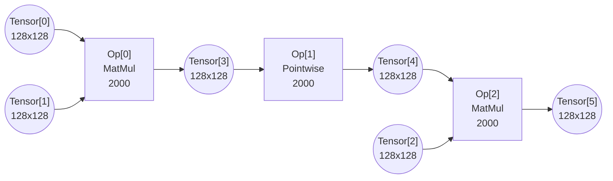

# Issue #84: Question Regarding the Internal Reduction Dimension

## Original post
- author: gychen233
- created_at: 2026-04-23T07:13:33Z
- url: https://github.com/yarongmu-google/MLSys/issues/84

<comment>
Thanks for the detailed explanations! I am completely clear on my previous questions.

Just to clarify one small detail about Example 5: Given that granularity[2] applies to all operators, both op0 and op1 will reduce 4 times (i.e., totally 4 * 4 = 16 computation steps). Does this mean that for latency calculations and when evaluating the memory rule ( "For any chosen execution granularity, the sum of the required input slices and the resulting output slices must fit simultaneously within the fast memory capacity" ), we only count each reduction of the output layer as a single macro-step (the 4 steps shown in the document), effectively folding the internal granular reductions into it?
</comment>

---

## Comment 1
- author: gychen233
- created_at: 2026-04-24T14:03:23Z
- url: https://github.com/yarongmu-google/MLSys/issues/84#issuecomment-4313774100

<comment>
If the answer is no, meaning that 16 steps were actually executed, would an OOM still not occur when the fast_memory_capacity is 128 * 32 + 32 * 32 + 32 * 128 + 128 * 128 = 25600?
</comment>

---

## Comment 2
- author: sohnryang
- created_at: 2026-04-24T14:21:05Z
- url: https://github.com/yarongmu-google/MLSys/issues/84#issuecomment-4313887014

<comment>
I also have this problem. Also, how is the subgraph executed when a pointwise op sits between the two matmuls, when granularity is set to (128, 128, 32)? i.e.,

</comment>

---

## Comment 3
- author: yarongmu-google
- created_at: 2026-04-24T18:38:02Z
- url: https://github.com/yarongmu-google/MLSys/issues/84#issuecomment-4315468884

<comment>
Thanks for the questions.

Re "Just to clarify one small detail about Example 5: Given that granularity[2] applies to all operators, both op0 and op1 will reduce 4 times (i.e., totally 4 * 4 = 16 computation steps). Does this mean that for latency calculations and when evaluating the memory rule ( "For any chosen execution granularity, the sum of the required input slices and the resulting output slices must fit simultaneously within the fast memory capacity" ), we only count each reduction of the output layer as a single macro-step (the 4 steps shown in the document), effectively folding the internal granular reductions into it?" -> not sure what this means, since there will only be 4 steps needed to compute the whole subgraph - not sure where 4 x 4 = 16 is from.

Re the given example graph: whether pointwise and matmul can be fused is based on linear algebra; so don't take this example's answer as universal. But just for this particular example: Ops 0, 1, and 2 can be in the same subgraph. This is because with a [128, 128, 32] granule, at each step, 1/4 of Tensor[3]'s cols will be produced, which can be fed to Op[1] to produce 1/4 of Tensor[4]'s columns, which is a valid matmul if you also load 1/4 of Tensor[2's rows, producing the full spatial tile of Tensor[5], at 1/4 reduction dimension. 
</comment>

---

## Comment 4
- author: yarongmu-google
- created_at: 2026-04-24T18:38:20Z
- url: https://github.com/yarongmu-google/MLSys/issues/84#issuecomment-4315470496

<comment>
I will resolve this for now. Please open a new issue, if the above doesn't make sense.
</comment>

---

